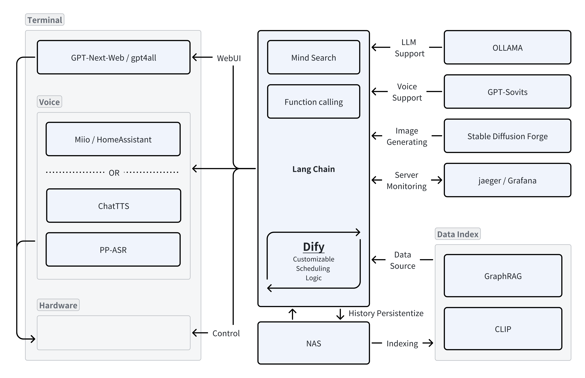

# 🛖Hestia
Hestia is a purely localized, personalized, and customizable AI Agent hub architecture that integrates voice assistant, smart home control, and basic LLM functions.
## Architecture

## Installation
Coming Soon
## Credits
Special thanks to the following projects

- [OLLAMA](https://github.com/ollama/ollama)
 | [LangChain](https://github.com/langchain-ai/langchainjs)
 | [Dify](https://github.com/langgenius/dify)

- [Miot](https://github.com/al-one/hass-xiaomi-miot/blob/master/README_zh.md)
 | [HomeAssistant](https://github.com/CCOSTAN/Home-AssistantConfig)
 | [Miio & HomeAssistant](https://www.home-assistant.io/integrations/xiaomi_miio/)
 | [Mi-GPT](https://github.com/idootop/mi-gpt)

- [ChatTTS](https://github.com/libukai/Awesome-ChatTTS)
 | [PP-ASR](https://aistudio.baidu.com/modelsdetail/25?modelId=25)
 | [sovits4](https://github.com/svc-develop-team/so-vits-svc/tree/4.1-Stable)
 | [GPT-Sovits](https://github.com/RVC-Boss/GPT-SoVITS) | 

- [GPT-Next-Web](https://github.com/ChatGPTNextWeb/ChatGPT-Next-Web)
 | [gpt4all](https://github.com/nomic-ai/gpt4all)

- [GraphRAG](https://github.com/microsoft/graphrag)
 | [RAGFlow](https://github.com/infiniflow/ragflow)
 | [CLIP](https://github.com/openai/CLIP)
 | [OpenCLIP](https://github.com/mlfoundations/open_clip)
 | [MindSearch](https://github.com/InternLM/MindSearch)

- [StableDiffusionForge](https://github.com/lllyasviel/stable-diffusion-webui-forge)
 | [ComfyUI](https://github.com/comfyanonymous/ComfyUI)

- [milvus](https://github.com/milvus-io/milvus)

- [OpenLIT](https://docs.openlit.io/latest/quickstart)
 | [Jaeger](https://www.jaegertracing.io)

